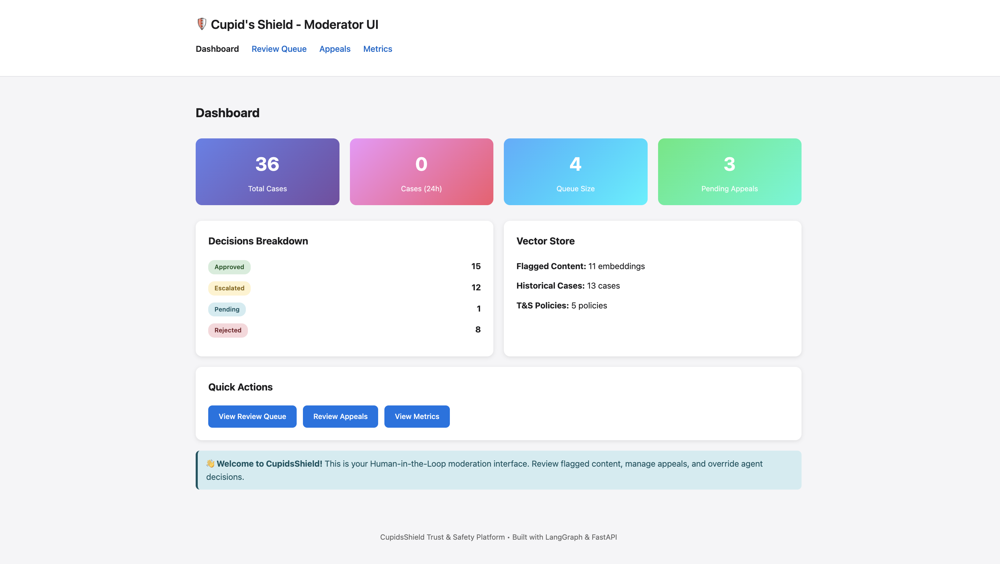
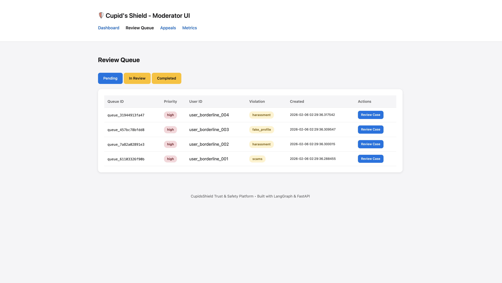
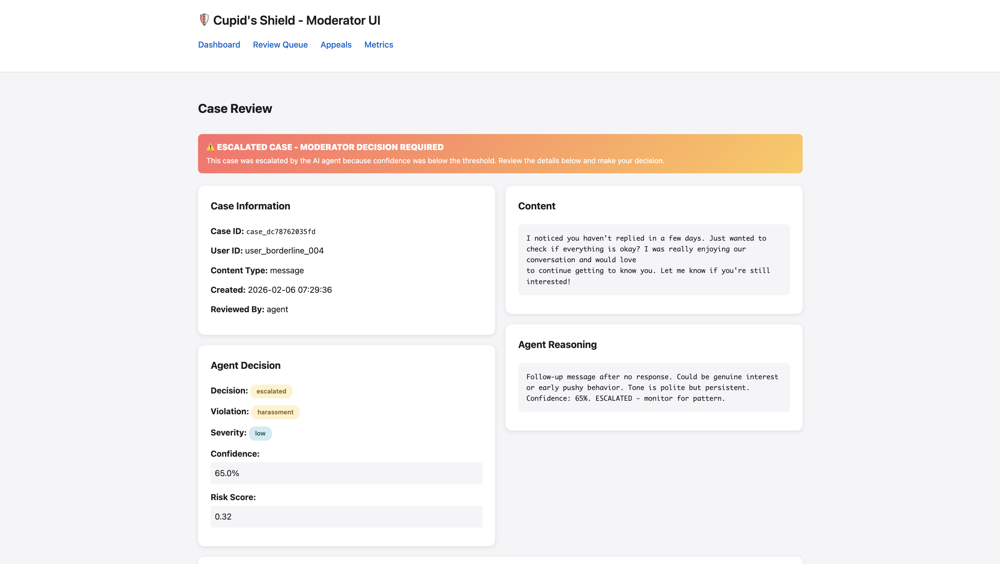
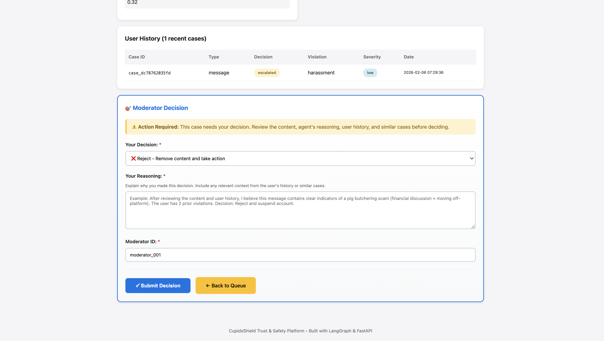
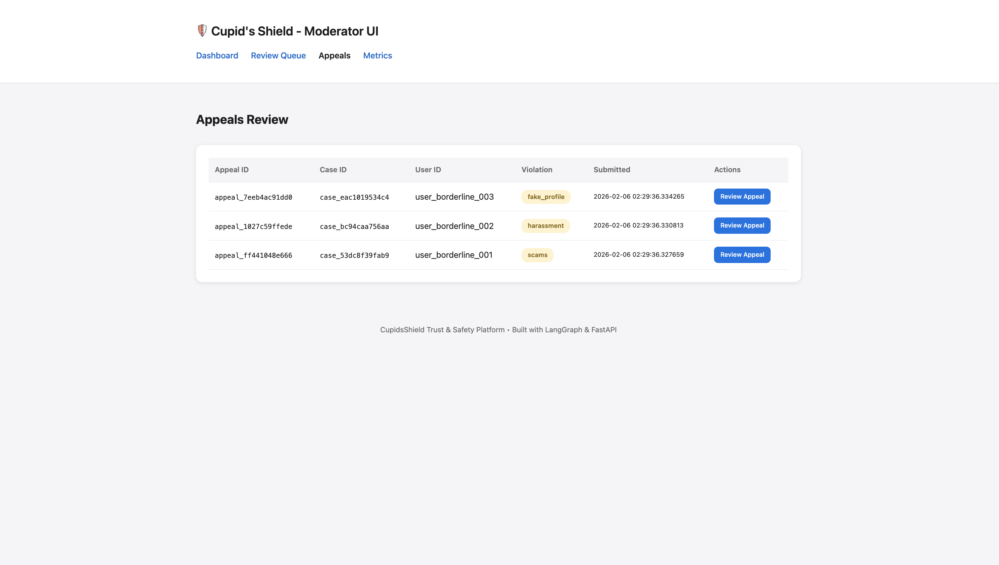
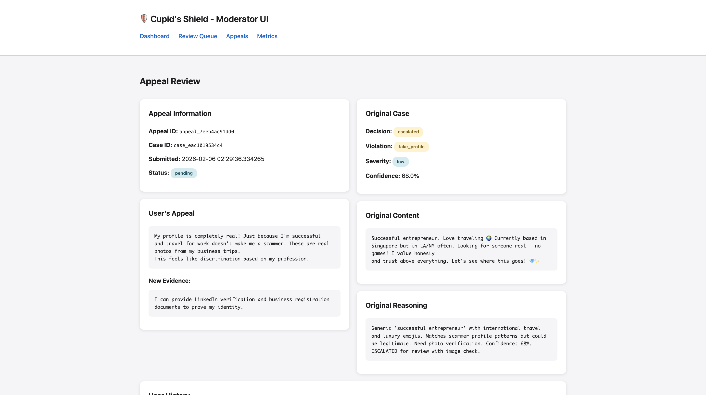
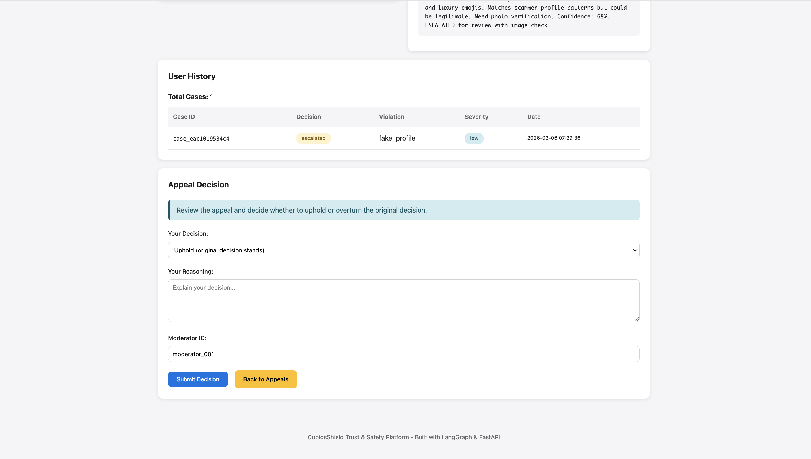
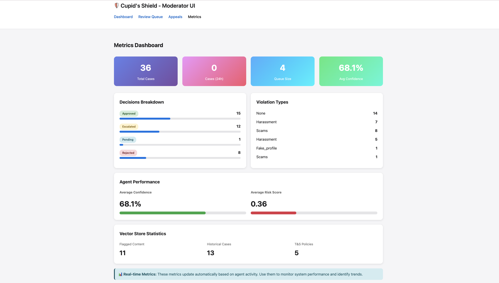
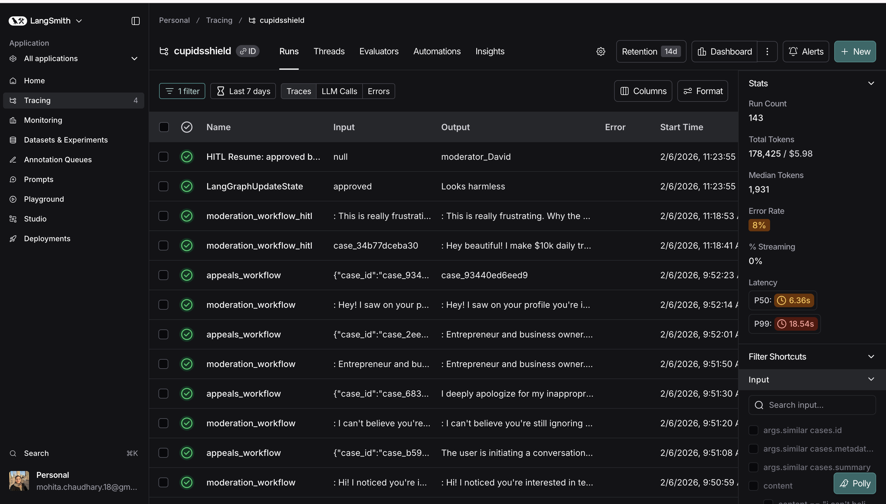
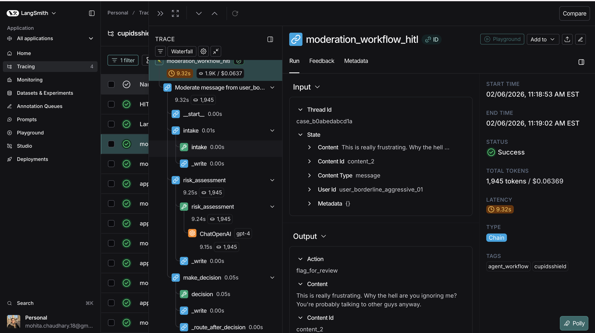

# CupidsShield

A production-grade Trust & Safety AI Agent system for dating platforms, built with LangGraph and ChromaDB. Provides automated content moderation, appeals processing, and human-in-the-loop review capabilities with complete observability through LangSmith.

---

## Table of Contents

- [Overview](#overview)
- [Demo & Screenshots](#demo--screenshots)
- [Architecture](#architecture)
- [Requirements](#requirements)
- [Installation](#installation)
- [Quick Start](#quick-start)
- [Usage](#usage)
- [Project Structure](#project-structure)
- [Features](#features)
- [Configuration](#configuration)

---

## Overview

**CupidsShield** is a comprehensive Trust & Safety system for dating platforms that combines AI automation with human oversight.

### Core Capabilities

- **Automated Content Moderation**: AI-powered detection of policy violations
- **Appeals Processing**: Structured review of user appeals with context retrieval
- **Human-in-the-Loop**: Confidence-based escalation to expert moderators
- **Pattern Detection**: Vector similarity search for identifying fraud patterns
- **Complete Observability**: End-to-end tracing and monitoring
- **Operator Interface**: Web-based UI for moderator workflows

### Key Use Cases

1. **Content Moderation**: Detect scams, harassment, fake profiles, inappropriate content
2. **Appeals Review**: Re-evaluate cases when users contest decisions
3. **Pattern Detection**: Identify pig butchering scams and fraud networks
4. **Human Oversight**: Route borderline cases for expert review with full context

---

## Demo & Screenshots

CupidsShield provides a complete Trust & Safety workflow with an intuitive operator interface and comprehensive observability. Below is a walkthrough of the key features with screenshots.

### 1. Dashboard Overview

Navigate to: `http://localhost:8000/`

The operator dashboard provides a real-time overview of system activity:
- **Total Cases**: Complete count with breakdown by decision type (Approved, Escalated, Pending, Rejected)
- **Review Queue**: Cases awaiting human moderator review
- **Pending Appeals**: User appeals requiring attention
- **Vector Store Statistics**: 
  - **Flagged Content**: 11 embeddings of known policy violations
  - **Historical Cases**: 13 past moderation cases for pattern matching
  - **T&S Policies**: 5 active Trust & Safety policies embedded for semantic search
- **Quick Actions**: Direct access to review queue, appeals, and metrics

The dashboard integrates ChromaDB vector search to surface relevant historical cases and policy violations, enabling moderators to make consistent decisions based on past precedents.



### 2. Moderation Queue - Human-in-the-Loop

Navigate to: `http://localhost:8000/queue`

The AI handles clear-cut cases automatically but escalates borderline ones for human review. The queue shows:
- Cases flagged for moderator review
- Confidence scores that triggered escalation
- Quick access to full case details



### 3. Case Review Interface

Click "Review Case" on any escalated item to see the full context:





The moderator interface provides complete context for informed decisions:

**Case Information:**
- Case ID, User ID, Content Type, Creation timestamp
- Reviewed by (agent or human moderator)

**Content Display:**
- Full message or profile content being reviewed
- Exact text that triggered the moderation flag

**Agent Decision:**
- Decision type (escalated, approved, rejected)
- Violation category (harassment, scams, fake_profile, etc.)
- Severity level (low, medium, high, critical)
- Confidence score (0-100%)
- Risk score calculation

**Agent Reasoning:**
- Detailed explanation of why the content was flagged
- Specific policy violations identified
- Context and patterns detected

**User History:**
- Complete moderation history for the user
- Past violations with dates and decisions
- Pattern of behavior over time

**Moderator Decision Section:**
- Action Required banner for escalated cases
- Decision dropdown: Approve / Reject / Escalate Further
- Required reasoning field with context guidance
- Moderator ID tracking for accountability
- Submit Decision and Back to Queue actions

This comprehensive context enables informed, consistent decisions with full audit trails.

### 4. Appeals Workflow

Navigate to: `http://localhost:8000/appeals`

When users contest decisions, they can submit appeals with explanations and new evidence. The appeals list shows all pending appeals awaiting moderator review.

### 5. Appeal Review

Click on an appeal to review:







The appeal interface shows:
- **Appeal Information**: Appeal ID, case ID, submission timestamp, and status
- **Original Case**: Decision, violation type, severity, and confidence score
- **User's Appeal**: Explanation and apology with context
- **New Evidence**: Additional information provided by the user
- **Original Content**: The content that was flagged
- **Original Reasoning**: Agent's initial analysis and decision rationale
- **User History**: Complete moderation history for the user
- **Appeal Decision**: Options to uphold or overturn with required reasoning

This comprehensive view ensures moderators have all context needed for fair appeal decisions.

### 6. Metrics & Analytics

Navigate to: `http://localhost:8000/metrics`



Track key performance indicators:
- **Total Cases**: Overall volume with 24-hour activity
- **Average Confidence**: Agent confidence scores (68.1% shown)
- **Queue Size**: Cases awaiting review
- **Decisions Breakdown**: Distribution across Approved, Escalated, Pending, and Rejected
- **Violation Types**: Breakdown by category (Harassment, Scams, Fake Profiles, etc.)
- **Agent Performance**: Average confidence and risk scores
- **Vector Store Statistics**: Flagged content, historical cases, and T&S policies tracked

Real-time metrics update automatically based on agent activity, enabling continuous monitoring of system performance and identification of trends.

### 7. LangSmith Observability

**CupidsShield uses LangSmith for complete end-to-end observability** of all agent workflows.

Navigate to: `https://smith.langchain.com/`



Every agent run is automatically traced, providing:
- **Run Count**: 143 total workflow executions tracked
- **Token Usage**: 178,425 tokens / $5.98 cost tracking
- **Performance Metrics**: P50 latency of 6.36s, P99 of 18.54s
- **Error Tracking**: 8% error rate with detailed diagnostics
- **Workflow Types**: Separate traces for moderation and appeals workflows

### 8. Detailed Trace View

Click on any trace to see the complete execution:



The trace view provides:
- **Workflow Graph**: Visual representation of all agent nodes
  - `intake` → `risk_assessment` → `make_decision` → `_route_after_decision`
- **LLM Calls**: Full prompts and responses with GPT-4
- **Timing Analysis**: 9.32s total with per-node breakdowns
- **Token Counts**: 1,945 tokens with cost tracking ($0.06)
- **State Inspection**: Input/output at each workflow step
- **Vector Searches**: ChromaDB similarity search operations
- **Database Operations**: All data layer interactions

**Why LangSmith Matters:**
- **Debugging**: Instantly identify where workflows fail or slow down
- **Optimization**: Find bottlenecks and reduce latency
- **Quality Assurance**: Review LLM responses for accuracy
- **Cost Management**: Track token usage and API costs
- **Compliance**: Complete audit trail of all AI decisions

This level of observability is critical for production Trust & Safety systems where every decision must be explainable and auditable.

---

## Architecture

```
┌─────────────────────────────────────────────────────────────┐
│                    OPERATOR INTERFACE (UI)                  │
│                   FastAPI + Jinja2 Templates                │
└─────────────────────┬───────────────────────────────────────┘
                      │
┌─────────────────────┴───────────────────────────────────────┐
│                   AGENTIC WORKFLOWS                         │
│  ┌─────────────────────────┐  ┌────────────────────────┐   │
│  │  Moderation Agent       │  │   Appeals Agent        │   │
│  │  (LangGraph)            │  │   (LangGraph)          │   │
│  │                         │  │                        │   │
│  │  • Intake               │  │  • Appeal Intake       │   │
│  │  • Risk Assessment      │  │  • Context Retrieval   │   │
│  │  • Decision             │  │  • Evaluation          │   │
│  │  • Action               │  │  • Decision            │   │
│  │  • Notification         │  │  • Resolution          │   │
│  └─────────────────────────┘  └────────────────────────┘   │
└─────────────────────┬───────────────────────────────────────┘
                      │
┌─────────────────────┴───────────────────────────────────────┐
│                    DATA LAYER                               │
│  ┌──────────────┐  ┌──────────────┐  ┌──────────────┐      │
│  │   SQLite     │  │   ChromaDB   │  │  LangSmith   │      │
│  │   (Cases)    │  │  (Vectors)   │  │  (Traces)    │      │
│  └──────────────┘  └──────────────┘  └──────────────┘      │
└─────────────────────────────────────────────────────────────┘
```

> **Note:** MCP (Model Context Protocol) server examples are included in the `mcp_servers/` directory for future integration but are not currently used in the active workflows.

### Decision Flow

```
Content Submitted
       │
       ▼
┌──────────────┐
│   Intake     │ ← Validate input
└──────┬───────┘
       │
       ▼
┌──────────────┐
│ Risk Assess  │ ← LLM analysis + Vector search
└──────┬───────┘
       │
       ▼
┌──────────────────────────────────┐
│   Confidence Threshold Check     │
└──┬───────────┬───────────────┬───┘
   │           │               │
   ▼           ▼               ▼
 >90%      85-90%          <70%
   │           │               │
   ▼           ▼               ▼
Approve     Reject        Escalate
            or Reject     to Human
```

### Technology Stack

| Component | Technology |
|-----------|-----------|
| **Agent Framework** | LangGraph |
| **LLM** | OpenAI GPT-4 |
| **Vector DB** | ChromaDB |
| **Database** | SQLite + aiosqlite |
| **UI Framework** | FastAPI + Jinja2 |
| **Observability** | LangSmith |
| **Embeddings** | Sentence Transformers |

> **Future Integration:** MCP (Model Context Protocol) server implementations are available in `mcp_servers/` for potential future use.

---

## Requirements

### Python Version
- Python 3.9 or higher

### Dependencies

```txt
# Core
langchain==0.3.15
langchain-openai==0.2.14
langgraph==0.2.60
langsmith==0.2.5

# Vector Store
chromadb==0.5.23
sentence-transformers==3.3.1

# Database
aiosqlite==0.20.0

# API & UI
fastapi==0.115.6
uvicorn==0.34.0
jinja2==3.1.5
python-multipart==0.0.20

# Utilities
python-dotenv==1.0.1
pydantic==2.10.4
```

### API Keys Required

1. **OpenAI API Key** - For GPT-4 inference
   - Get from: https://platform.openai.com/api-keys

2. **LangSmith API Key** - For tracing and monitoring
   - Get from: https://smith.langchain.com/

---

## Installation

### 1. Clone or Navigate to Project

```bash
cd /CupidsShield
```

### 2. Install Dependencies

```bash
pip3 install -r requirements.txt
```

### 3. Configure Environment Variables

Create a `.env` file in the project root:

```bash
# OpenAI
OPENAI_API_KEY=sk-...

# LangSmith (for tracing)
LANGCHAIN_TRACING_V2=true
LANGCHAIN_API_KEY=lsv2_pt_...
LANGCHAIN_PROJECT=cupidsshield
```

### 4. Initialize Databases

```bash
# Initialize SQLite database
python3 -m data.db init

# Initialize ChromaDB vector store
python3 -m data.vector_store init
```

---

## Quick Start

### Step 1: Start the Operator UI

```bash
python3 -m uvicorn ui.app:app --reload
```

The UI will be available at: **http://localhost:8000**

### Step 2: Begin Processing Content

Use the Python API to submit content for moderation:

```python
from agents import run_moderation

result = await run_moderation(
    content_type="message",
    content="User-generated content here",
    user_id="user_123"
)
```

### Step 3: Access Operator Interface

1. **Dashboard** - `http://localhost:8000/`
   - System overview and statistics

2. **Review Queue** - `http://localhost:8000/queue`
   - Escalated cases awaiting moderator decisions
   - Click "Review Case" to see full context and make decisions

3. **Appeals** - `http://localhost:8000/appeals`
   - User appeals contesting decisions
   - Review explanations and evidence before final decisions

4. **Metrics** - `http://localhost:8000/metrics`
   - Performance analytics and violation breakdown

5. **LangSmith** - `https://smith.langchain.com/`
   - Complete workflow traces for debugging and optimization

---

## Usage

### Running Moderation on New Content

```python
from agents import run_moderation

result = await run_moderation(
    content_type="message",
    content="Hey! Want to invest in crypto with me?",
    user_id="user_123"
)

print(result['decision'])  # 'approved', 'rejected', or 'escalated'
print(result['confidence'])  # 0.0 to 1.0
print(result['violation_type'])  # 'scams', 'harassment', etc.
```

### Processing an Appeal

```python
from agents import run_appeal

result = await run_appeal(
    case_id="case_abc123",
    user_explanation="I wasn't trying to scam anyone...",
    new_evidence="I have 2 years of clean history"
)

print(result['appeal_decision'])  # 'upheld', 'overturned', 'escalated'
```

### Making Moderator Decisions via UI

1. Navigate to the Review Queue: `http://localhost:8000/queue`
2. Click "Review Case" on an escalated item
3. Review the content, agent reasoning, and context
4. Select decision: Approve / Reject / Escalate
5. Add your reasoning (required)
6. Submit decision

---

## Project Structure

```
cupidsshield/
├── README.md                    # This file
├── requirements.txt             # Python dependencies
├── pyproject.toml              # Project configuration
├── .env                        # Environment variables (not committed)
│
├── unified_demo.py             # ONE script to create all demo data
├── view_database.py            # Utility to inspect database
│
├── agents/                     # LangGraph agent workflows
│   ├── __init__.py
│   ├── moderation_agent.py    # Content moderation workflow
│   ├── appeals_agent.py       # Appeals review workflow
│   ├── state.py               # Typed state definitions
│   └── prompt_loader.py       # Dynamic prompt loading
│
├── ui/                         # FastAPI operator interface
│   ├── __init__.py
│   ├── app.py                 # Main FastAPI application
│   └── templates/             # Jinja2 HTML templates
│       ├── base.html
│       ├── dashboard.html
│       ├── queue.html
│       ├── case_detail.html
│       ├── appeals.html
│       ├── appeal_detail.html
│       └── metrics.html
│
├── data/                       # Data layer
│   ├── __init__.py
│   ├── db.py                  # SQLite database operations
│   ├── vector_store.py        # ChromaDB vector operations
│   ├── schema.sql             # Database schema
│   ├── cupidsshield.db        # SQLite database (generated)
│   └── chromadb/              # ChromaDB storage (generated)
│
├── mcp_servers/               # MCP examples (for future integration)
│   ├── moderation_tools/      # Example: Content flagging, banning
│   ├── database/              # Example: Database access tools
│   └── notifications/         # Example: User notification tools
│
├── prompts/                   # Prompt templates (customizable)
│   ├── moderation/
│   │   ├── scam_detection.txt
│   │   ├── harassment.txt
│   │   ├── fake_profile.txt
│   │   └── base_moderation.txt
│   └── appeals/
│       └── review.txt
│
├── monitoring/                # Observability
│   ├── __init__.py
│   └── tracing.py            # LangSmith tracing decorators
│
├── config/                    # Configuration
│   ├── __init__.py
│   ├── moderation.yaml       # Moderation policies
│   └── appeals.yaml          # Appeals policies
│
└── examples/                  # Example scenarios
    ├── pig_butchering_scam.txt
    ├── harassment_threat.txt
    ├── fake_profile.txt
    └── clean_content.txt
```

---

## Features

### 1. Agentic Workflows (LangGraph)

- **Multi-step orchestration** with state management
- **Conditional routing** based on confidence thresholds
- **Two complete workflows**: Moderation + Appeals
- **Node-level tracing** for observability

**Moderation Workflow:**
```
Intake → Risk Assessment → Decision → Action → Notification
```

**Appeals Workflow:**
```
Appeal Intake → Context Retrieval → Evaluation → Decision → Resolution
```

### 2. Human-in-the-Loop Design

- **Confidence-based escalation**: Cases with 70-85% confidence go to human review
- **Full context for moderators**: Content, agent reasoning, user history, similar cases
- **Required reasoning**: All decisions must include moderator rationale
- **Audit trail**: Complete logging for compliance

### 3. Vector Similarity Search

- **ChromaDB** for semantic similarity
- **Historical case retrieval**: Find similar past violations
- **Pattern detection**: Identify scam patterns across users
- **Policy embeddings**: Semantic search through T&S policies

### 4. Dating-Specific Trust & Safety

**Scam Detection:**
- Pig butchering scams (crypto investment + romance)
- Financial exploitation
- Off-platform migration (WhatsApp, Telegram)

**Harassment Detection:**
- Threats and violence
- Persistent unwanted contact
- Emotional manipulation

**Fake Profile Analysis:**
- Generic "entrepreneur" profiles
- Stock photo indicators
- Inconsistent information

### 5. Observability with LangSmith

- **Complete workflow tracing**: Every agent run is logged
- **LLM call inspection**: View prompts and responses
- **Performance metrics**: Timing, token usage, costs
- **Debugging**: Node-level execution details

### 6. Operator Enablement

- **Intuitive UI**: Clean FastAPI interface
- **Prompt libraries**: Customizable prompt templates
- **Configuration files**: Policy rules in YAML
- **Documentation**: Comprehensive guides

---

## Troubleshooting

### UI Not Running?

```bash
# Start the UI server
python3 -m uvicorn ui.app:app --reload --host 0.0.0.0 --port 8000
```

### No LangSmith Traces?

```bash
# Check environment variables
cat .env | grep LANGCHAIN

# Should see:
# LANGCHAIN_TRACING_V2=true
# LANGCHAIN_API_KEY=lsv2_pt_...
# LANGCHAIN_PROJECT=cupidsshield
```

### Database Issues?

```bash
# Reinitialize everything
rm -f ./data/cupidsshield.db
rm -rf ./data/chromadb

python3 -m data.db init
python3 -m data.vector_store init
```

### Reset and Start Fresh

```bash
# Clean slate
rm -f ./data/cupidsshield.db
rm -rf ./data/chromadb

# Reinitialize
python3 -m data.db init
python3 -m data.vector_store init

# Create demo data
python3 unified_demo.py

# Start UI
python3 -m uvicorn ui.app:app --reload
```

---

## Viewing Data

### View Database Contents

```bash
python3 view_database.py
```

Or directly with SQLite:

```bash
sqlite3 ./data/cupidsshield.db

# View all cases
SELECT id, user_id, decision, confidence, violation_type
FROM moderation_cases;

# View pending appeals
SELECT id, user_explanation, appeal_decision
FROM appeals
WHERE appeal_decision = 'pending';

# View review queue
SELECT * FROM review_queue WHERE status = 'pending';
```

---

## Configuration

### Moderation Policies

Edit `config/moderation.yaml`:

```yaml
confidence_thresholds:
  auto_approve: 0.90      # Auto-approve if confidence > 90%
  auto_reject: 0.85       # Auto-reject if confidence > 85%
  escalate: 0.70          # Escalate to human if confidence < 70%

policy_rules:
  scams:
    actions:
      critical: "permanent_ban"
      high: "temporary_ban"
      medium: "warning"
```

### Prompt Templates

Edit files in `prompts/moderation/`:

- `scam_detection.txt` - Pig butchering scam detection
- `harassment.txt` - Harassment and threats
- `fake_profile.txt` - Fake profile analysis
- `base_moderation.txt` - General moderation

---

## Key Metrics

The system tracks:

- **Decision Accuracy**: Agent vs human agreement rate
- **Escalation Rate**: % of cases needing human review
- **Response Time**: Average time per decision
- **Violation Breakdown**: Distribution by type
- **Appeal Rate**: % of decisions appealed
- **Overturn Rate**: % of appeals that overturn original decision

View in UI: `http://localhost:8000/metrics`

---

## License

This is a demonstration project.

---

## Built With

- [LangGraph](https://github.com/langchain-ai/langgraph) - Agent workflow orchestration
- [LangChain](https://github.com/langchain-ai/langchain) - LLM application framework
- [ChromaDB](https://www.trychroma.com/) - Vector database
- [FastAPI](https://fastapi.tiangolo.com/) - Modern web framework
- [LangSmith](https://smith.langchain.com/) - LLM observability platform

---

**Built for Trust & Safety**
